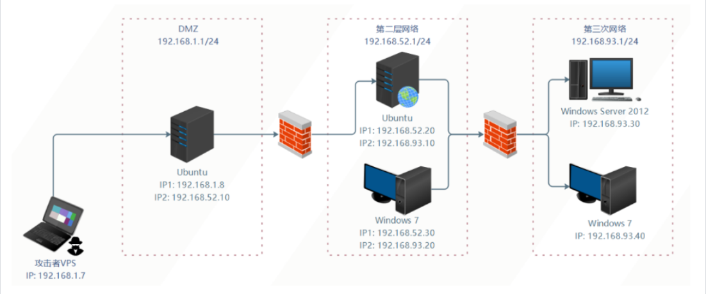
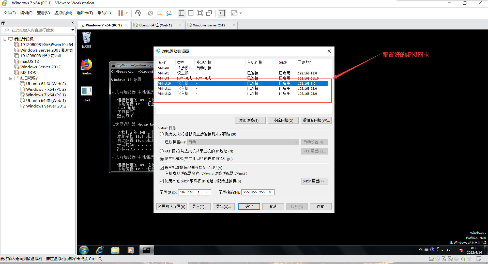

## 红日靶场七

### 前言

首先打这个靶场是为了了解一下最近两三年的危害比较大的漏洞，然后还可以同时学习一下这个近似于现实环境的靶场是如何攻入的。我觉得这会对我的渗透能力的提升帮助很大，而且我也觉是时候培养一下内网的渗透思路了，所以打个靶场试试，并且把渗透的主要思路记录如下。主要也是照着网上的各位师傅的文章给弄的（毕竟有的地方我也搞不太明白），照着网上做的地方我会写出引用的内容的出处，我能力与文笔都比较差，如果又哪里不对或者不当请不吝指出，我将不胜感激。


### 一、靶场配置

#### 1、靶场环境示意图

下面是靶场环境示意图：

{.img-fluid}

首先呢，因为靶场环境实在是太大了，我这里难以带动五台占用2G(总共10G)的虚拟机同时运行，所以我先对上图中的第一层和第二层网络进行渗透。


#### 2、靶场网卡配置

上面的环境示意图应该都不难理解，那我就直接写网卡的配置了。根据上图所示的ip地址的配置，这里需要有三张网卡，分别是：

| 网卡       | ip地址       | 网关          |
| ---------- | ------------ | ------------- |
| 第一张网卡 | 192.168.1.0  | 255.255.255.0 |
| 第二张网卡 | 192.168.520  | 255.255.255.0 |
| 第三张网卡 | 192.168.93.0 | 255.255.255.0 |

{.img-fluid}

然后DMZ分前两张网卡、第二层网络分后两张网卡、第三层分最后一张网卡。那么，网卡的配置基本上到这里就结束了。


#### 3、靶机用户名和密码[^1]

```
域用户账户和密码如下：
Administrator：Whoami2021
whoami：Whoami2021
bunny：Bunny2021
moretz：Moretz2021
Ubuntu 1：
	web：web2021
Ubuntu 2：
	ubuntu：ubuntu

通达OA账户：
admin：admin657260（我用administrator:Whoami2021启动的）
```

[^1]: 红日靶场七-内网渗透练习 [https://bbs.zkaq.cn/t/5415.html](https://bbs.zkaq.cn/t/5415.html)

#### 4、靶机服务配置

>!!! danger "靶场中各个主机都运行着相应的服务并且没有自启功能，如果我们关闭了靶机，再次启动时还需要在相应的主机上启动靶机服务!"
>
>
>
>**DMZ区的 Ubuntu 需要启动Nginx和Redis服务：**
>
>- redis-server /etc/redis.conf
>- /usr/sbin/nginx -c /etc/nginx/nginx.conf
>- iptables -F
>
>
>
>**第二层网络的 Ubuntu需要启动Docker容器：**
>
>- sudo service docker start
>- sudo docker start 8e172820ac78
>
>
>
>**第三层网络的 Windows 7（PC 1）需要启动通达OA：**
>
>- C:\MYOA\bin\AutoConfig.exe
>- 经过测试需要开启防火墙，不然扫不到


